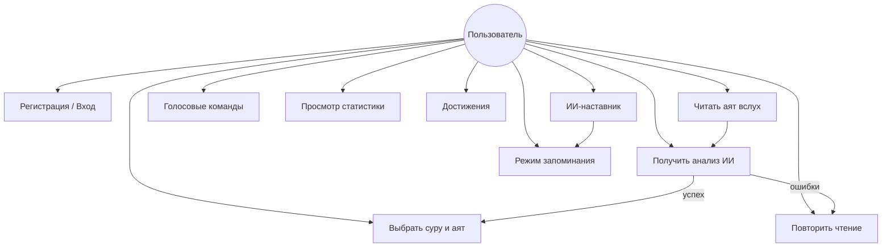
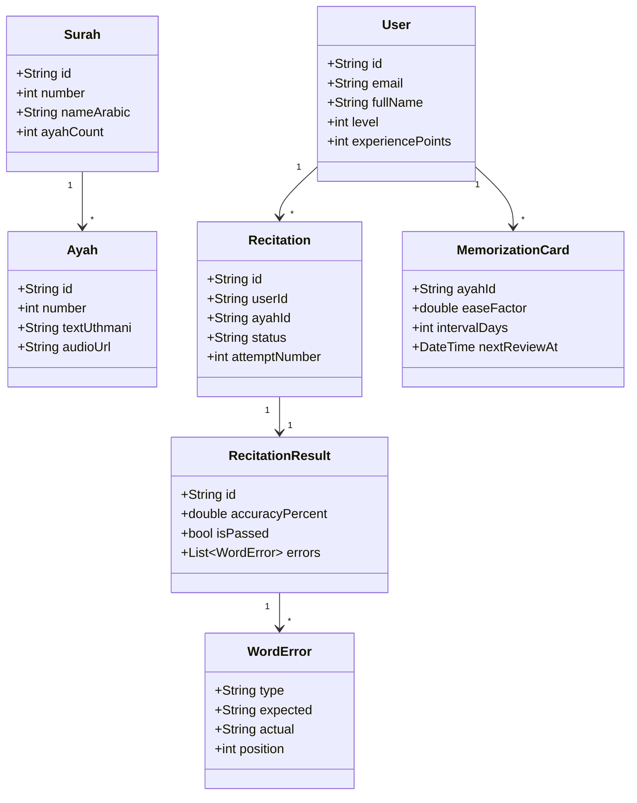
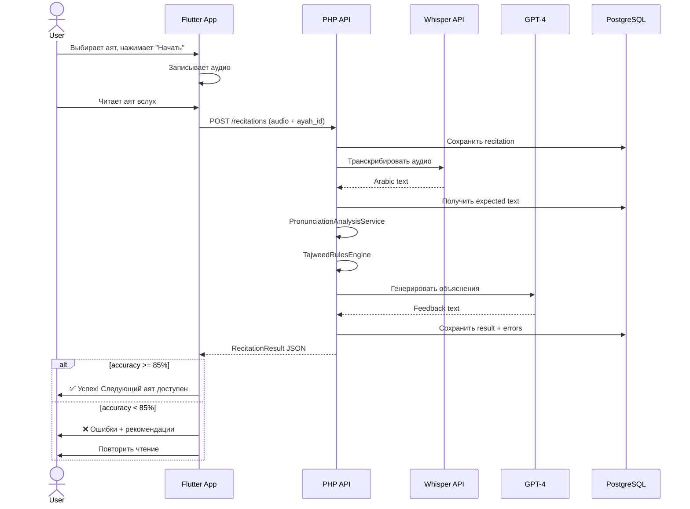
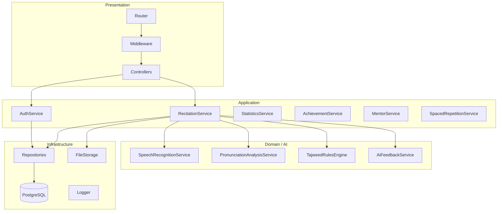
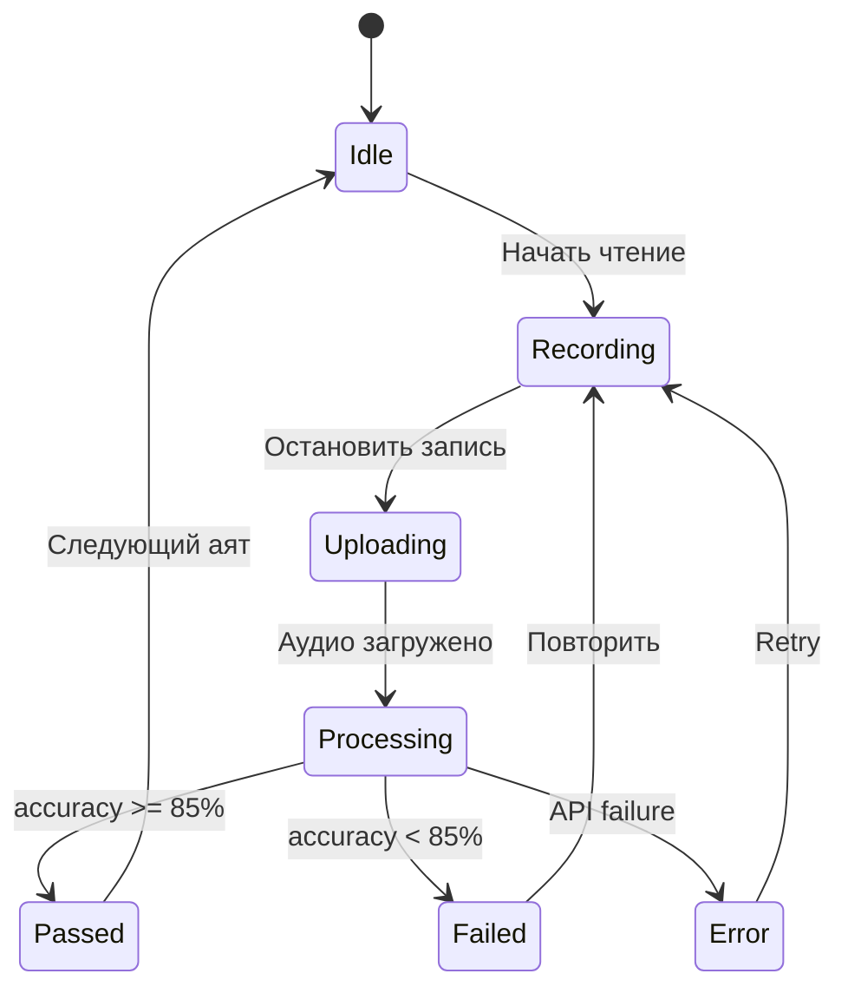
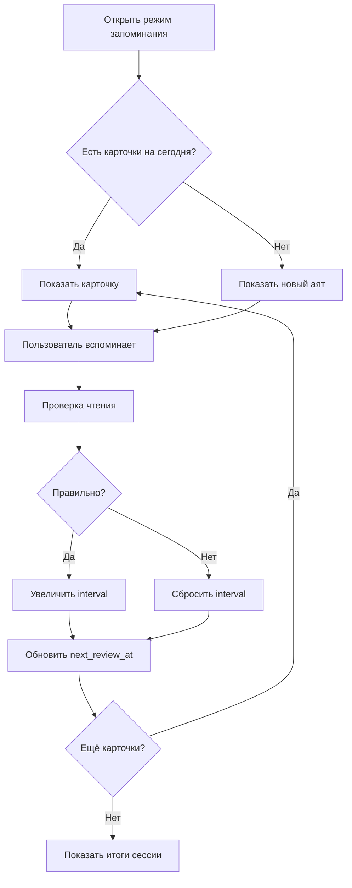
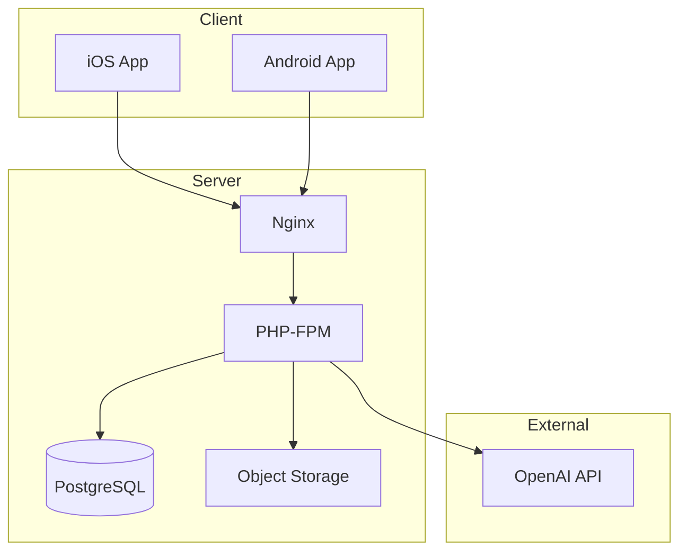

# UML-диаграммы Jattau

## 1. Use Case Diagram

## 2. Class Diagram — Domain (Flutter)

## 3. Sequence Diagram — Проверка чтения

## 4. Component Diagram — Backend

## 5. State Diagram — Recitation

## 6. Activity Diagram — SRS (Запоминание)

## 7. Deployment Diagram

